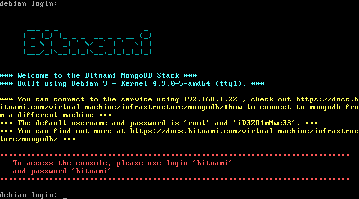
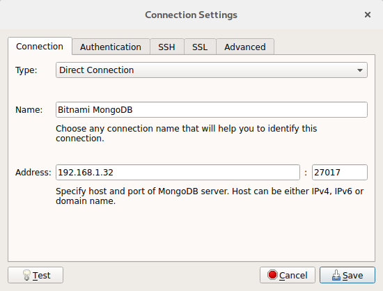
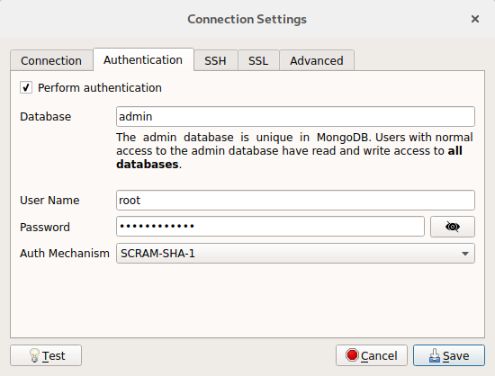
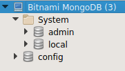
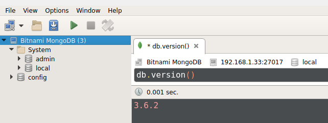

# MongoDB

De las bases de datos NoSQL mencionadas en el capítulo anterior, vamos a estudiar MongoDB. El motivo es que es la base de datos NoSQL más popular y utilizada, además está orientada a documentos lo cual permite usarla en distintas situaciones más comodamente. Esta base de datos comenzó su desarrollo en 2007 de la mano de la empresa **10gen** y tuvo su lanzamiento en 2009. Es una base de datos multiplataforma de forma que se puede instalar en Linux, Windows y OSX. Está escrita en C++ y tiene una licencia [GNU AGPL 3.0](https://es.wikipedia.org/wiki/GNU_Affero_General_Public_License), lo que significa que es libre. Por último hay que recordar que está orientada a documentos de esquema libre diseñada para el desarrollo y la escalabilidad, es decir, poder crecer para manejar un gran volumen de información.

Dicho todo esto, ¿dónde utilizar MongoDB? Pues donde queramos obviamente, sin embargo, hay que reiterar sus puntos fuertes. Escalabilidad, y uso de documentos sin esquemas definidos aunque sí que es cierto que es necesario definirlo cuando la diseñemos porque si no, vamos a tener problemas en el futuro. Posiblemente sea más importante saber cuándo no utilizar MongoDB o sus puntos débiles. Lo primero a tener en cuenta es que no existen las **transacciones**, que para quien no recuerde lo que son, en base de datos una transaccion es un conjunto de instrucciones que se ejecutan como una sola, es decir, o se ejecutan completamente o se deshacen, de forma atómica. ¿Por qué es tan importante? Porque una transacción nos asegura la integridad de datos y cuando estamos modificando datos de varias tablas esto es fundamental. sin embargo, MongoDB solo nos lo asegura a nivel de documento. En esta base de datos tampoco nos vamos a encontrar con la operación **join**, por lo que para consultar datos relacionados de varias colecciones, es necesario realizar una serie de consultas y no una sola como sí que podemos hacer en nuestras conocidas bases de datos relacionales. El último punto en contra o que no vamos a encontrar son las consultas de **agreación**, es decir, el famoso **group by** de SQL y demás funciones de agreación que son muy utilizadas a la hora de sacar informes, de forma, que si vamos a tener que utilizar este tipo de consultas MongoDB ahora mismo tampoco es la necesaria u óptima para el proyecto, aunque como ya he mencionado en un mismo proyecto podemos tener varias bases de datos trabajando de forma coordinada.

## Relacionando conceptos

Para entender los conceptos propios de MongoDB como son **colecciones**, **documentos** y **campos**, lo mejor es relacionarlos con los que ya conocemos del modelo relacional. Para empezar Un mismo servidor de MongoDB puede contener varias **bases de datos**. A su vez una base de datos está formada entre otras cosas por **colecciones**, que serían lo que entendemos por **tablas**. Una colección almacena ninguno, uno o varios documentos, por lo que podemos decir que un **documento** actuaría como una **fila**, por lo que se entiende que todos los documentos de una misma colección van a del mismo tipo, como pueden ser usuarios, facturas o lo que queramos almacenar. Sin embargo, y esto puede ser en lo que más se diferencia, cada documento tiene un conjunto de **campos**, que lo podríamos relacionar con las **columnas** de una tabla, con la salvedad de que en una tabla todas las filas tienen las mismas columnas, mientras que en una colección el esquema de cada documento puede variar, lo cual se ha de tener en cuenta a la hora de tratarlos a nivel de la base de datos o de los programas que la ataquen.

## Formato de documentos: BSON y JSON

Sabemos que MongoDB trabaja con documentos, pero hasta ahora no hemos dicho qué formato tienen dichos documentos, a nivel interno, binario, el formato es **BSON**, que almacena un **JSON** y algunos datos extra como la longitud de los campos y demás. Sin embargo, el formato externo será **JSON**. Para quien no sepa qué es JSON, puede ir la [página oficial](https://www.json.org/json-es.html) y comprobar el formato.

Para resumirlo, un archivo JSON, almacena pares de clave : valor, donde todas las claves, al menos en MongoDB son de tipo cadena de caracteres y el valor pueden ser números, cadenas de caracteres, arrays, booleanos, fechas, etc o incluso nuevos documentos u objetos JSON. Un ejemplo sería:

```JSON
{
	name : "John",
	age : 25,
	hobbies : ["sports", "music"]
}
```

Este archivo sería válido en formato JSON, sin embargo, hay un atributo llamaddo "\_id" que indica la clave de un documento y que MongoDB permite informalo con el valor que consideremos oportuno, pero que si nose realiza como es el ejemplo anterior, automáticamente le asignará un valor del estilo `ObjectId("52f602d787945c344bb4bda5")`, tampoco vamos a entrar en detalles, pero la documentación oficial indica cómo se generan.

Una de las ventajas de utilizar JSON como formato de documento es que muchos lenguajes tienen librerías o paquetes para manejarlos de forma cómoda además de que hay traducción entre los tipos que se almacenan en un archivo y los que los propios lenguajes utilizan.

## Instalación

Como ocurre en muchas bases de datos, por un lado tenemos la base de datos en sí, instalamos un programa o serie de programas que ejecutan tanto la base de datos como los servicios que dan acceso a la misma. Por otro lado tenemos los programas cliente gráficos que se conectan a la base de datos, estos pueden ser de la misma empresa como ocurre con SQL developer de Oracle o MySQL Workbench de MySQL, del mismo moodo para MongoDB existe la aplicación MongoDB Compass. Tanto los instaladores para el servidor de MongoDB como el de compass están disponible en la página oficial [mongodb.com](www.mongodb.com).

Sin embargo y debido a que vamos a evitar instalar el servidor en nuestro equipo optamos por utilizar una máquina virtual con MongoDB, para ello hay que recurrir a las que facilita [bitnami](bitnami.com), que por si no las conocéis tiene infinidad de aplicaciones y múltiples opciones para el uso de cada una como son contenedor docker, instalador y máquina virtual. En nuestro caso accederemos la página de [máquina virtual de MongoDB](https://bitnami.com/stack/mongodb/virtual-machine), la descargaremos e importaremos en nuestra aplicación de virtualbox o vmware, la que se prefiera. Una vez importada y arrancada tendremos una pantalla como esta:



Lo primero que debemos hacer es iniciar sesión en el sistema para ello utilizamos bitnami/bitnami y cambiamos la contraseña. Antes de conectarnos a la base de datos necesitamos permitir la conexión a la misma, y en el caso de mongodb el puertos es el 27017. Escribimos en la consola `sudo ufw allow 27017` y para comprobar qué puertos están abiertos ejecutamos `sudo ufw status`. Con esto ya tendríamos lista la parte del servidor por llamarlo de alguna manera.

Por otro lado vamos a descargar una aplicación cliente de nuestra base de datos. Nos decantamos por Robo 3T, anteriormente Robomongo, que en la sección de [descargas](https://robomongo.org/download) de su página podemos encontrar la aplicación para linux, windows y OSx. Una vez instalado, debemos configurar la conexión, en principio, solo necesitamos rellenar las pestañas de connection y authentication. Quedando la primera de la siguiente manera:



Siendo la IP, la que nos indique la máquina virtual. En el caso del ejemplo la configuración de red es adaptador puente en virtualbox de forma que la dirección es una dentro de la red local en la que se encuentra el equipo. Por otro lado, la pestaña authentication:



Donde root es el administrador y la! contraseña nos aparece en el terminal nada más arrancar la máquina virtual. Una vez conectados, nos aparecen las bases de datos que existen por defecto:



Por último, para abrir una shell, no tenemos más que pinchar con el botón derecho encima de la conexión y seleccionar la primer opción Open shell. Nos aparecerá una pestaña divida en dos partes, la superior donde podremos escribir las instrucciones y la inferior donde se mostrarán los resultados de la misma, por ejemplo:



## Enlaces:

[MongoDB manual](https://docs.mongodb.com/manual/)

[Genbetadev: Una introducción a MongoDB](https://www.genbetadev.com/bases-de-datos/una-introduccion-a-mongodb)

[Genbetadev: MongoDB, qué es, cómo funciona y cuándo podemos usarlo o no](https://www.genbetadev.com/bases-de-datos/mongodb-que-es-como-funciona-y-cuando-podemos-usarlo-o-no)

[Wikipedia: MongoDB](https://es.wikipedia.org/wiki/MongoDB)
